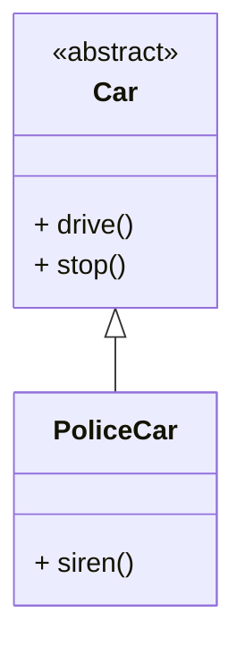
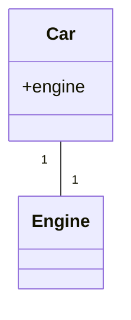

# is-a, has-a

## is-a

[OOP](/concepts/Object-oriented_programming)에서 **is-a**는 추상화(예: 타입, 클래스) 간의 포괄적 관계로, 한 클래스 A가 다른 클래스 B의 하위 클래스인 경우를 말한다(B는 A의 상위 클래스).

예를 들어, '경찰차'는 '자동차'이지만 그 반대는 아니다. 모든 경찰차는 자동차이지만, 모든 자동차가 경찰차는 아니다.
모든 자동차에 관련된 동작은 자동차 클래스에 정의되고, 경찰차에게만 관련된 동작은 경찰차 클래스에 정의된다.
자동차 클래스를 경찰차 클래스를 '확장(extending)'하는 것으로 정의함으로써,
모든 경찰차는 자동차를 위해 해당 동작을 명시적으로 코딩할 필요 없이 자동차에 대해 정의된 동작을 '상속(inherit)'받는다.

## has-a

has-a 관계는 포함 또는 구성 관계를 의미한다.
즉, “A는 B를 가진다”라는 문장으로 표현할 수 있으며, 한 객체가 다른 객체를 자신의 멤버 변수로 포함하는 관계이다.
예를 들어, “자동차는 엔진을 가진다”, “원은 점을 가진다”처럼 어떤 클래스가 다른 클래스의 객체를 필드로 포함할 때 사용한다.
이 관계는 상속보다 결합도가 낮아, 구성 요소를 쉽게 변경할 수 있고 더 유연한 구조를 제공한다.
하지만 모든 경우에 has-a가 is-a보다 낫다고 할 수는 없으며, 상황에 따라 적절히 선택해야 한다.

### 참고 자료

- [is-a, has-a (en.Wikipedia.org)](https://en.wikipedia.org/wiki/Is-a)
