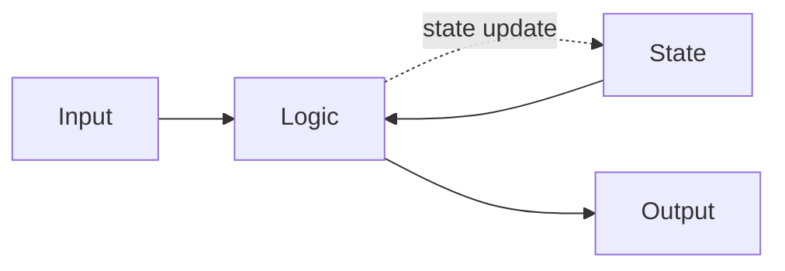

# State machine (상태 머신)

State machine 은 다음과 같은 방식으로 작동하는 시스템이다.

1. 시스템에 입력 이벤트가 들어온다.
2. 프로그램 로직이 입력 이벤트와 프로그램의 현재 상태를 바탕으로 판단을 내린다.
3. 프로그램 로직이 프로그램의 상태를 바꾼다.
4. 프로그램 로직은 출력을 만들 수도 있다.

상태머신은 다음과 같이 작동한다. 시스템에 입력 이벤트가 들어오면, 프로그램 로직이 그 이벤트와 현재 상태를 바탕으로 판단을 내리고 상태를 바꾼 후 출력을 만든다.

흥미로운 점은 실제로 무언가 유용한 일을 수행하는 모든 프로그램이 기능적으로는 상태 기계와 동일하다는 것이다. 어떤 프로그램이든 state machine으로 다시 쓸 수 있기 때문이다.

다만 전통적인 상태 기계 방식으로 작성된 코드는 읽기 어렵고 깨지기 쉽다. 한편 상태 기계는 매우 효율적이기 때문에, 이런 방식의 코딩을 용인하는 주된 이유로 효율성을 꼽는 경우가 많다.

그런데 프로그래머의 진정한 할 일은 상태 기계를 관리 가능하도록 잘 조직하는 것이다. 코드의 크기가 크거나 기억력이 한계가 있을 때 모든 것을 한꺼번에 기억하기란 불가능하기 때문이다.
따라서 프로그래머의 주된 과업은 코드를 구조화해서 변경하기 쉽도록 만드는 것, 다시 말해 복잡도 관리다.[^1]

---

[^1]: 함수형 반응형 프로그래밍 - 스티븐 블랙히스, 앤서니 존스
