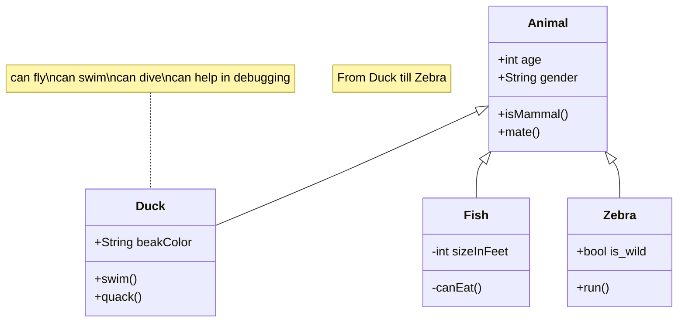
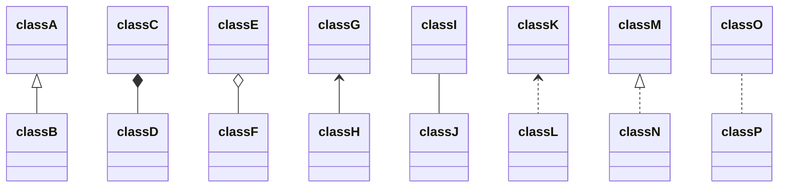

# UML, Unified Modeling Language

UML은 소프트웨어 공학에서 사용되는 표준화된 범용 모델링 언어이다.

#### Class Example

#### Defining Relationship

| Type  | Description   |
| ----- | ------------- |
| `<--` | Inheritance   |
| `*--` | Composition   |
| `o--` | Aggregation   |
| `-->` | Association   |
| `--`  | Link (Solid)  |
| `..>` | Dependency    |
| `..>` | Realization   |
| `..`  | Link (Dashed) |

### Resources

- [통합 모델링 언어(wikipedia.org)](https://ko.wikipedia.org/wiki/통합_모델링_언어)
- [UML(wikipedia.org)](https://en.wikipedia.org/wiki/Unified_Modeling_Language)
