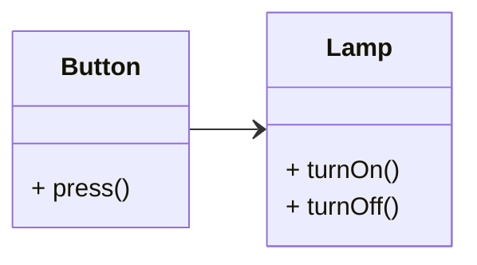
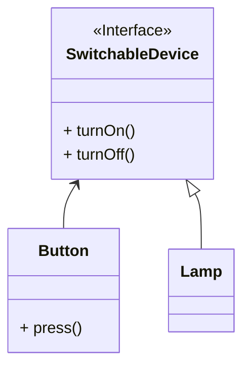

# Dependency Inversion Principle

- 고수준 모듈은 저수준 모듈에 의존해서는 안 된다. 둘 다 추상화에 의존해야 한다.
- 추상화는 세부 사항에 의존해서는 안 된다. 세부 사항이 추상화에 의존해야 한다.
  {/* Button --|> Lamp */}



```typescript
// 저수준 모듈: 램프 구현
class Lamp {
  turnOn() {}
  turnOff() {}
}

// 고수준 모듈: 버튼 구현
class Button {
  private lamp: Lamp;

  constructor(lamp: Lamp) {
    this.lamp = lamp;
  }

  press() {
    if (/**/) {
      this.lamp.turnOn();
    } else {
      this.lamp.turnOff();
    }
  }
}

const lamp = new Lamp();
const lampButton = new Button(lamp);

lampButton.press(); // on
lampButton.press(); // off
```



```typescript
// 추상화: 장치 활성화 인터페이스
interface SwitchableDevice {
  turnOn(): void;
  turnOff(): void;
}

// 저수준 모듈: 램프 구현
class Lamp implements SwitchableDevice {
  turnOn() {}
  turnOff() {}
}

// 저수준 모듈: 다른 장치 구현 (예: 선풍기)
class Fan implements SwitchableDevice {
  turnOn() {}
  turnOff() {}
}

// 고수준 모듈: 버튼 구현
class Button {
  private device: SwitchableDevice;

  constructor(device: SwitchableDevice) {
    this.device = device;
  }

  press(): void {
    if (/**/) {
      this.device.turnOn();
    } else {
      this.device.turnOff();
    }
  }
}

// 램프로 버튼 사용
const lamp = new Lamp();
const lampButton = new Button(lamp);

lampButton.press(); // on
lampButton.press(); // off

// 선풍기로 버튼 사용
const fan = new Fan();
const fanButton = new Button(fan);

fanButton.press(); // on
fanButton.press(); // off
```

---
