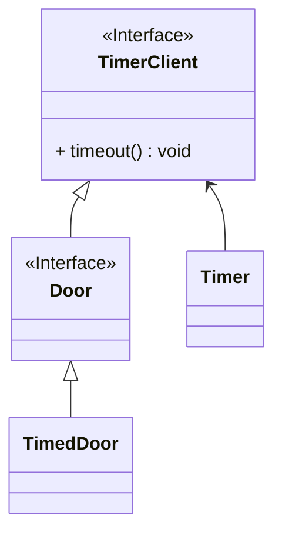
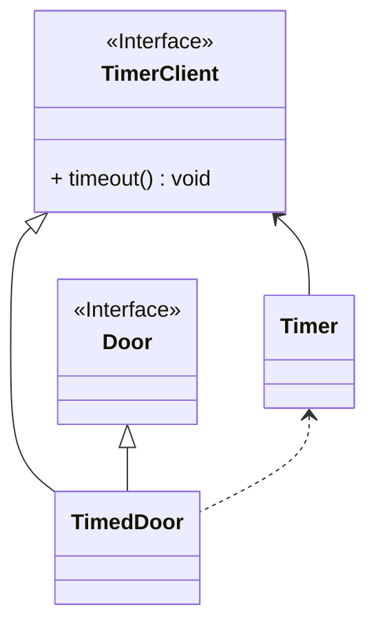

# ISP, Interface Segregation Principle (인터페이스 분리 원칙)

```typescript
interface Door {
  lock(): void;
  unlock(): void;
  isDoorOpen(): boolean;
}
```

```typescript
interface TimerClient {
  timeout(): void;
}

interface Door extends TimerClient {
  lock(): void;
  unlock(): void;
  isDoorOpen(): boolean;
}

class Timer {
  register(delay: number, client: TimerClient) {
    setTimeout(() => {
      client.timeout();
    }, delay);
  }
}
class TimedDoor implements Door {
  private isOpen: boolean = false;
  private timer: Timer;

  constructor(timer: Timer) {
    this.timer = timer;
  }
  lock() {
    this.isOpen = false;
  }
  unlock() {
    this.isOpen = true;
    this.timer.register(5000, this);
  }
  isDoorOpen() {
    return this.isOpen;
  }
  timeout() {
    if (this.isOpen) {
      /* timeout 처리 */
    }
  }
}
```



Door의 인터페이스는 불필요한 메서드로 오염되었다. 단지 서브클래스 중 하나의 이득을 위해 이 메서드를 포함시켜야 했다.

#### 다중 구현(Multiple Implementation) or 다중 상속(Multiple Inheritance) 을 통한 분리

```typescript
interface TimerClient {
  timeout(): void;
}

class Timer {
  register(delay: number, client: TimerClient) {
    setTimeout(() => {
      client.timeout();
    }, delay);
  }
}
interface Door {
  lock(): void;
  unlock(): void;
  isDoorOpen(): boolean;
}

class TimedDoor implements Door, TimerClient {
  private isOpen: boolean = false;
  private timer: Timer;

  constructor(timer: Timer) {
    this.timer = timer;
  }

  lock() {
    this.isOpen = false;
  }
  unlock() {
    this.isOpen = true;
    this.timer.register(5000, this);
  }
  isDoorOpen() {
    return this.isOpen;
  }
  timeout() {
    if (this.isOpen) {
      /* timeout 처리 */
    }
  }
}
```


