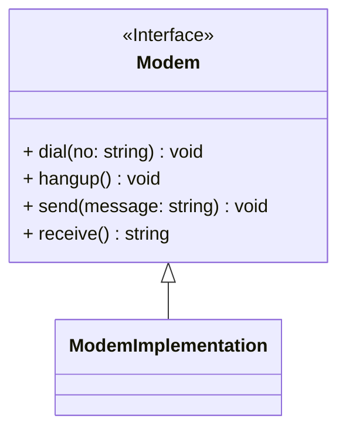
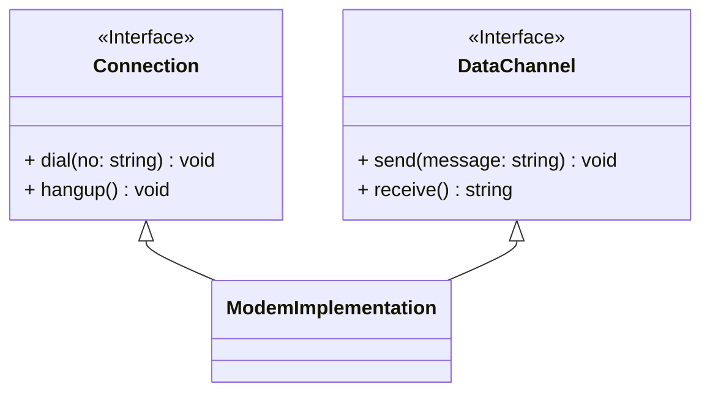

# SRP, Single Responsibility Principle (단일 책임 원칙)

한 모듈은 단 한가지의 변경 이유만을 가져야 한다.

---

다음의 모뎀 인터페이스를 보면, 모뎀이 가지고 있는 기능들을 볼 수 있다.

```typescript
interface Modem {
  dial(no: string): void;
  hangup(): void;
  send(message: string): void;
  receive(): string;
}

class ModemImplementation implements Modem {
  //...
}
```



여기서 `dial`과 `hangup`은 모뎀의 연결을 관리하고, `send`와 `receive`는 데이터를 송수신하는 기능이다.

이 두가지 책임은 분리되어야 할까? 이것은 애플리케이션의 변경에 달려 있다.
만약 애플리케이션 디자인으로 인해 `send`와 `receive`가 자주 변경되는 경우, 이 디자인은 **[경직성의 악취](/concepts/design-smells)** 를 풍기게 되고, 다음과 같이 분리되어야 한다.
이렇게 하면 2개의 책임이 결합되는 것을 피할 수 있다.

```typescript
interface Connection {
  dial(no: string): void;
  hangup(): void;
}

interface DataChannel {
  send(message: string): void;
  receive(): string;
}

class ModemImplementation implements Connection, DataChannel {
  //...
}
```



하지만 애플리케이션이 서로 다른 시간에 두 가지 책임의 변경을 유발하는 방식으로 바뀌지 않는다면, 이들을 분리하면 안된다. 분리하면 오히려 **[불필요한 복잡성](/concepts/design-smells#불필요한-복잡성)** 이란 악취를 풍기게 된다.

`ModemImplementation` 클래스는 두 책임이 결합된 상태로 남아 있다. 바람직한 일은 아니지만, 모든 의존성은 필요악일 수 있다. 하지만 인터페이스는 분리하여 애플리케이션의 나머지 부분에 한해 개념을 분리했다.
불편하게 보일 수 있지만, `main` 외에는 아무것도 이 클래스에 의존하지 않기 때문에 문제가 되지 않는다.[^1]

### Resources

- [Single-responsibility principle (wikipedia.org)](https://en.wikipedia.org/wiki/Single-responsibility_principle)
- [Curly의 법칙](/generic/curlys-law.mdx)

---

[^1]: 클린 소프트웨어, [Robert C. Martin](/people/Robert_C._Martin), 2002, SRP
