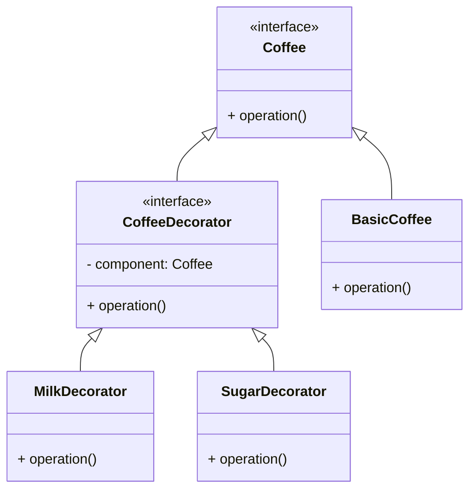

# Decorator Pattern(데코레이터 패턴)

[OOP](/concepts/Object-oriented_programming)에서 decorator pattern은 동일한 클래스의 다른 인스턴스의 동작에는 영향을 주지 않으면서,
개별 객체에 동작을 동적으로 추가할 수 있게 해주는 [디자인 패턴](/pattern/Design_patterns)이다.

```typescript
// 기본 component interface
interface Coffee {
  cost(): number;
  description(): string;
}

// 기본 concrete component
class BasicCoffee implements Coffee {
  cost(): number {
    return 2000;
  }
  description(): string {
    return "기본 커피";
  }
}

// 데코레이터 추상 클래스
abstract class CoffeeDecorator implements Coffee {
  protected coffee: Coffee;

  constructor(coffee: Coffee) {
    this.coffee = coffee;
  }

  cost(): number {
    return this.coffee.cost();
  }

  description(): string {
    return this.coffee.description();
  }
}

// 데코레이터 구현
class MilkDecorator extends CoffeeDecorator {
  cost(): number {
    return super.cost() + 500;
  }

  description(): string {
    return super.description() + ", 우유";
  }
}

class SugarDecorator extends CoffeeDecorator {
  cost(): number {
    return super.cost() + 300;
  }

  description(): string {
    return super.description() + ", 설탕";
  }
}

// 사용
let myCoffee: Coffee = new BasicCoffee();
console.log(myCoffee.description(), myCoffee.cost()); // 기본 커피 2000

myCoffee = new MilkDecorator(myCoffee);
console.log(myCoffee.description(), myCoffee.cost()); // 기본 커피, 우유 2500

myCoffee = new SugarDecorator(myCoffee);
console.log(myCoffee.description(), myCoffee.cost()); // 기본 커피, 우유, 설탕 2800
```



### References

- [Decorator Pattern (en.Wikipedia.org)](https://en.wikipedia.org/wiki/Decorator_pattern)
