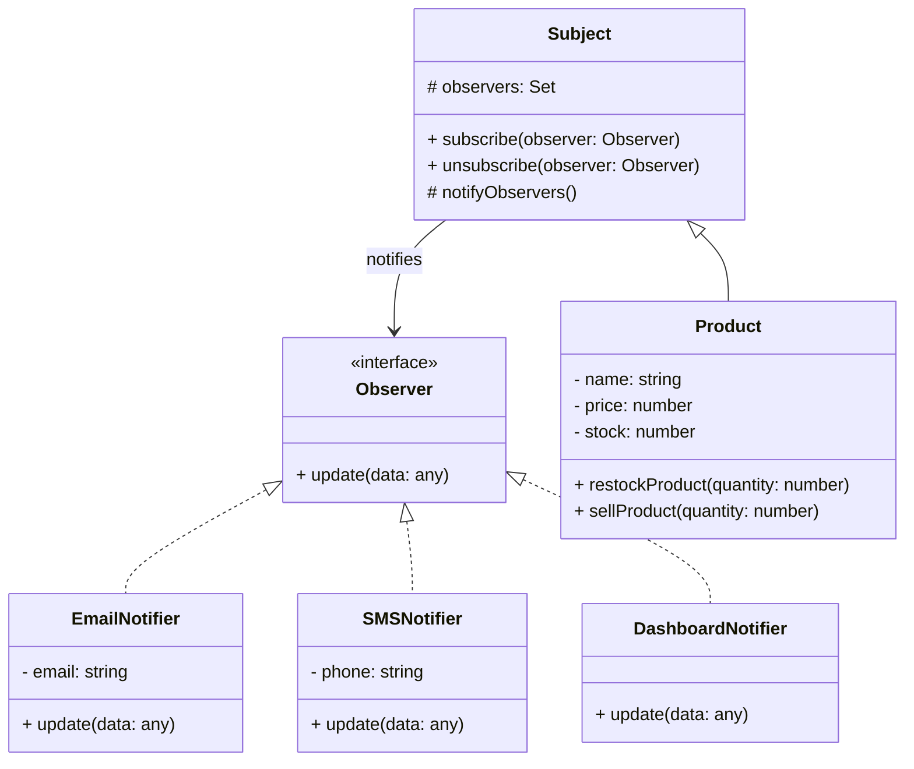

# Observer Pattern(옵저버 패턴)

Observer Pattern은 [OOP](/concepts/Object-oriented_programming)에서 객체 간의 느슨한 결합을 유지하면서, 한 객체의 상태가 변할 때 그 객체에 의존하는 모든 객체들에게 자동으로 알릴 수 있게 해주는 [디자인 패턴](/pattern/Design_patterns)이다.

## Core Concepts(핵심 개념)

- **Subject** - 상태를 가지고 있고 상태 변화를 관리하는 객체
- **Observer** - 상태 변화를 관찰하고 대응하는 객체
- **Loose Coupling** - Subject는 Observer 구현에 의존하지 않음
- **One-to-Many Relationship** - 하나의 Subject가 여러 Observer에게 알림

## Key Benefits(주요 이점)

- 느슨한 결합 - Subject와 Observer 간의 의존성 최소화
- 동적 관계 - 런타임에 Observer 추가/제거 가능
- 변경 전파 - 상태 변화를 자동으로 모든 Observer에게 통지
- 단일 책임 - 각 객체가 하나의 책임만 가짐

## Simple Example(간단한 예제)

온라인 쇼핑몰의 상품 재입고 알림 시스템을 Observer 패턴으로 구현한 예제이다.

### 1. Observer Interface

```typescript
// src/observers/Observer.ts
export interface Observer {
  update(data: any): void;
}
```

### 2. Subject Class

```typescript
// src/subjects/Product.ts
import { Observer } from "../observers/Observer";

export class Product {
  private observers: Set<Observer> = new Set();
  private stock: number;

  constructor(
    private name: string,
    private price: number,
    initialStock: number
  ) {
    this.stock = initialStock;
  }

  // Observer 등록
  subscribe(observer: Observer): void {
    this.observers.add(observer);
  }

  // Observer 제거
  unsubscribe(observer: Observer): void {
    this.observers.delete(observer);
  }

  // 모든 Observer에게 알림
  private notifyObservers(): void {
    this.observers.forEach((observer) => {
      observer.update({
        product: this.name,
        stock: this.stock,
        price: this.price,
      });
    });
  }

  // 재입고
  restockProduct(quantity: number): void {
    if (quantity <= 0) {
      throw new Error("Quantity must be positive");
    }

    this.stock += quantity;
    console.log(`[${this.name}] 재입고: +${quantity}개`);
    this.notifyObservers();
  }

  // 상품 판매
  sellProduct(quantity: number): void {
    if (quantity > this.stock) {
      throw new Error("Insufficient stock");
    }

    this.stock -= quantity;
    console.log(`[${this.name}] 판매: -${quantity}개`);

    if (this.stock === 0) {
      this.notifyObservers();
    }
  }

  getStock(): number {
    return this.stock;
  }
}
```

### 3. Concrete Observer Classes

```typescript
// src/observers/EmailNotifier.ts
import { Observer } from "./Observer";

export class EmailNotifier implements Observer {
  constructor(private email: string) {}

  update(data: any): void {
    console.log(
      `📧 이메일 발송 (${this.email}): "${data.product}"의 재입고 알림`
    );
    console.log(`   현재 재고: ${data.stock}개, 가격: ${data.price}원`);
  }
}

// src/observers/SMSNotifier.ts
import { Observer } from "./Observer";

export class SMSNotifier implements Observer {
  constructor(private phone: string) {}

  update(data: any): void {
    console.log(
      `📱 문자 발송 (${this.phone}): "${data.product}" 입고됨! 재고: ${data.stock}개`
    );
  }
}

// src/observers/DashboardNotifier.ts
import { Observer } from "./Observer";

export class DashboardNotifier implements Observer {
  update(data: any): void {
    console.log(
      `📊 대시보드 업데이트: "${data.product}" 상태 변경 (재고: ${data.stock}개)`
    );
  }
}

// src/observers/AnalyticsTracker.ts
import { Observer } from "./Observer";

export class AnalyticsTracker implements Observer {
  update(data: any): void {
    console.log(
      `📈 분석 기록: "${data.product}" 재고 이벤트 (재고: ${data.stock}개)`
    );
  }
}
```

### 4. 사용 예제

```typescript
// src/main.ts
import { Product } from "./subjects/Product";
import { EmailNotifier } from "./observers/EmailNotifier";
import { SMSNotifier } from "./observers/SMSNotifier";
import { DashboardNotifier } from "./observers/DashboardNotifier";
import { AnalyticsTracker } from "./observers/AnalyticsTracker";

// 상품 생성
const laptop = new Product("MacBook Pro", 2500000, 0);

// Observer 등록
const emailNotifier = new EmailNotifier("customer@example.com");
const smsNotifier = new SMSNotifier("010-1234-5678");
const dashboardNotifier = new DashboardNotifier();
const analyticsTracker = new AnalyticsTracker();

laptop.subscribe(emailNotifier);
laptop.subscribe(smsNotifier);
laptop.subscribe(dashboardNotifier);
laptop.subscribe(analyticsTracker);

// 재입고 이벤트
console.log("=== 재입고 이벤트 발생 ===");
laptop.restockProduct(10);

// 출력:
// [MacBook Pro] 재입고: +10개
// 📧 이메일 발송 (customer@example.com): "MacBook Pro"의 재입고 알림
//    현재 재고: 10개, 가격: 2500000원
// 📱 문자 발송 (010-1234-5678): "MacBook Pro" 입고됨! 재고: 10개
// 📊 대시보드 업데이트: "MacBook Pro" 상태 변경 (재고: 10개)
// 📈 분석 기록: "MacBook Pro" 재고 이벤트 (재고: 10개)

// Observer 제거
laptop.unsubscribe(analyticsTracker);

console.log("\n=== 판매 이벤트 (분석 추적 제거됨) ===");
laptop.sellProduct(5);

// 출력:
// [MacBook Pro] 판매: -5개
// 📧 이메일 발송 (customer@example.com): ...
// 📱 문자 발송 (010-1234-5678): ...
// 📊 대시보드 업데이트: ...
// (📈 분석 기록은 출력되지 않음)
```

## 클래스 다이어그램



## Modern JavaScript/TypeScript: Built-in Patterns

### 1. EventEmitter (Node.js)

```typescript
import { EventEmitter } from "events";

const emitter = new EventEmitter();

// Observer 등록
emitter.on("restock", (data) => {
  console.log(`📧 이메일 알림: ${data.product}`);
});

emitter.on("restock", (data) => {
  console.log(`📱 문자 알림: ${data.product}`);
});

// 이벤트 발행
emitter.emit("restock", { product: "MacBook Pro", stock: 10 });
```

### 2. RxJS (Reactive Programming)

```typescript
import { Subject } from "rxjs";

const productSubject = new Subject();

// Observer 등록
productSubject.subscribe((data) => {
  console.log(`📧 이메일 알림: ${data.product}`);
});

productSubject.subscribe((data) => {
  console.log(`📱 문자 알림: ${data.product}`);
});

// 이벤트 발행
productSubject.next({ product: "MacBook Pro", stock: 10 });
```

## Real-World Use Cases(실제 사용 사례)

- **이벤트 핸들링** - DOM 이벤트, 버튼 클릭 등
- **상태 관리** - Redux, Vuex, MobX의 기초
- **실시간 알림** - 채팅, 주식 시세 업데이트
- **UI 업데이트** - 모델 변경 시 뷰 자동 갱신
- **서드파티 통합** - 웹훅, 이벤트 구독 시스템

## Key Points(핵심 포인트)

- **느슨한 결합** - Subject와 Observer가 서로를 강하게 참조하지 않음
- **동적 구독** - 런타임에 Observer 추가/제거 가능
- **자동 통지** - 상태 변경 시 모든 Observer에게 자동으로 알림
- **메모리 관리** - Observer 제거 시 메모리 누수 주의 필요
- **성능** - Observer 수가 많으면 통지 성능 저하 가능

## Pros and Cons(장단점)

### Pros ✅
- 객체 간의 느슨한 결합
- 동적 관계 설정 가능
- 상태 변화를 효율적으로 전파

### Cons ❌
- Observer 제거 시 메모리 누수 위험
- Observer 통지 순서 불명확
- 많은 Observer가 있으면 성능 저하
- 디버깅 어려움 (복잡한 이벤트 흐름)

## References

- [Observer Pattern (en.Wikipedia.org)](https://en.wikipedia.org/wiki/Observer_pattern)
- [Observer Pattern (refactoring.guru)](https://refactoring.guru/design-patterns/observer)
